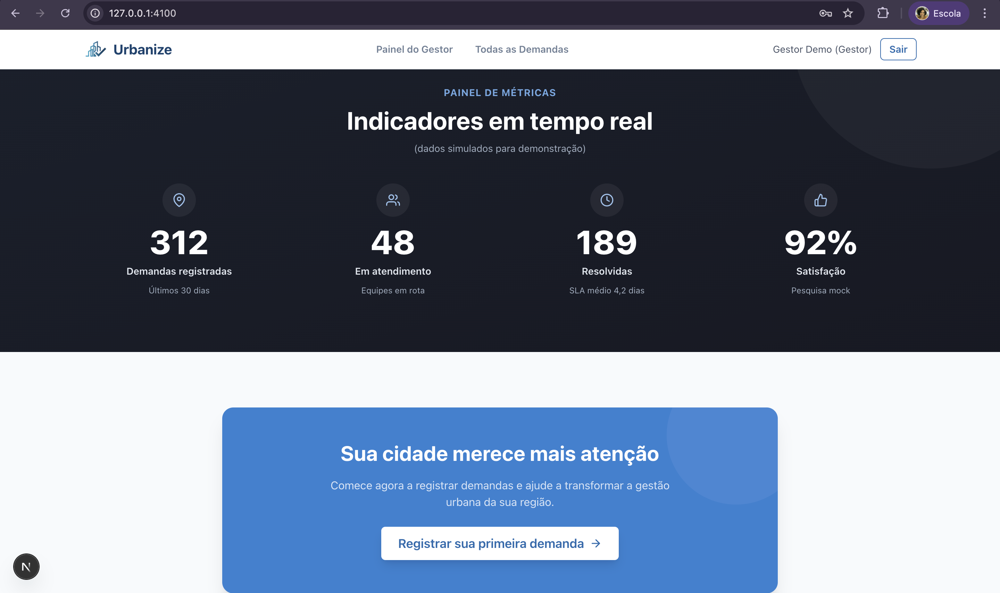
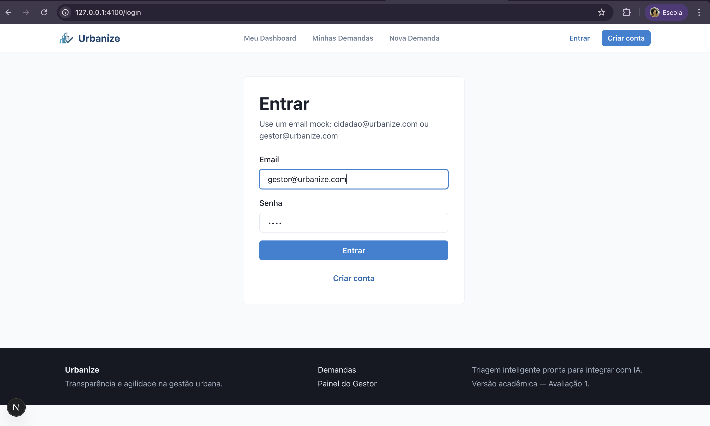
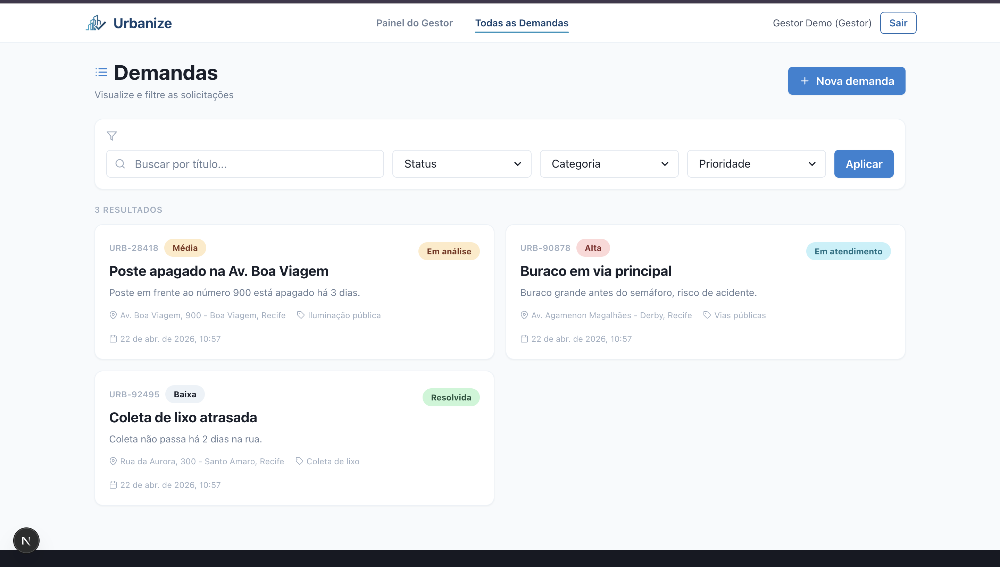
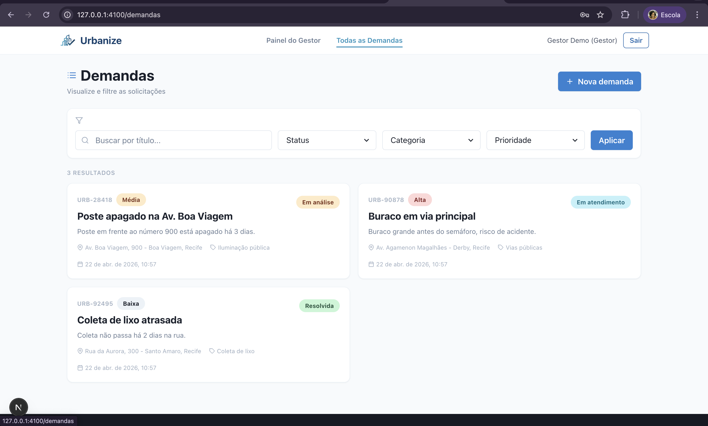
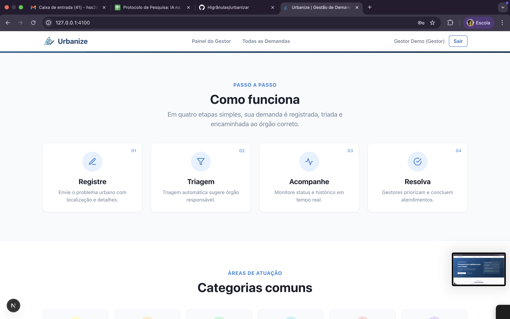

# Urbanize

> Plataforma de gestão de demandas urbanas com backend real, banco persistente e diferenciação de perfis (Cidadão e Gestor)



**Stack:** Next.js 16 • TypeScript • Chakra UI • Zustand • Node.js • Express • Prisma ORM • JWT • Cookies • Redis opcional • Cron Jobs

## Início rápido

```bash
# Instalar dependências
npm install

# Preparar banco local
npm run db:migrate
npm run db:seed

# Rodar backend Express
npm run dev:backend

# Rodar frontend
npm run dev:frontend

# Acessar
 http://127.0.0.1:4100
```

**Credenciais de teste:**
- Cidadão: `cidadao@urbanize.com` / `demo`
- Gestor: `gestor@urbanize.com` / `demo`

**Backend:** `http://localhost:4000/api`  
**Frontend:** `http://127.0.0.1:4100`

<details>
<summary>Scripts disponíveis</summary>

- `npm run dev:frontend` - Servidor Next.js de desenvolvimento
- `npm run dev:backend` - API Express com Prisma, JWT, Redis opcional e cron
- `npm run db:migrate` - Criar/aplicar migrações Prisma
- `npm run db:seed` - Popular usuários e demandas de demonstração

</details>

<details>
<summary>Solução de problemas</summary>

**Porta ocupada:**
```bash
lsof -ti tcp:4100 | xargs kill
```

**Mudar porta:**
```bash
npm run dev -- --hostname 127.0.0.1 --port 4101
```

</details>

## Funcionalidades principais

### Autenticação e perfis

O perfil do usuário é definido no cadastro e validado no backend:

- **Cidadão** → cria e acompanha suas próprias demandas
- **Gestor público** → visualiza a fila geral, revisa triagens e altera status

A autenticação usa senha com hash, JWT, cookie HTTP-only e proteção por perfil.


### Perfil Cidadão

**Permissões:**
- ✅ Criar novas demandas
- ✅ Visualizar suas próprias demandas
- ✅ Acompanhar status e timeline
- ✅ Consultar métricas pessoais
- ❌ Alterar status de demandas
- ❌ Acessar painel do gestor

**Navegação:**
- `/dashboard` - Visão geral pessoal
- `/demandas` - Minhas demandas
- `/demandas/nova` - Criar nova demanda
- `/demandas/:id` - Detalhes da demanda

<details>
<summary>Ver jornada completa do cidadão</summary>

Consulte a [documentação de jornadas](docs/jornada-usuario.md) para fluxos detalhados, permissões e cenários de teste.

</details>

### Perfil Gestor

**Permissões:**
- ✅ Visualizar todas as demandas da cidade
- ✅ Alterar status de demandas
- ✅ Adicionar observações
- ✅ Revisar triagem automática
- ✅ Visualizar métricas gerais
- ❌ Criar novas demandas

**Navegação:**
- `/gestor` - Painel de gestão
- `/demandas` - Todas as demandas
- `/demandas/:id` - Gerenciar demanda





<details>
<summary>Ver jornada completa do gestor</summary>

Consulte a [documentação de jornadas](docs/jornada-usuario.md) para fluxos detalhados, permissões e cenários de teste.

</details>

### Proteção de rotas

O sistema implementa controle de acesso automático:

- Usuários não autenticados → Redirecionados para `/login`
- Cidadão tentando acessar `/gestor` → Redirecionado para `/dashboard`
- Gestor tentando acessar `/dashboard` ou `/demandas/nova` → Redirecionado para `/gestor`

### Triagem inteligente

Regra de negócio executada no backend:
- Classificação por categoria informada
- Sugestão de órgão responsável
- Score simples de confiança
- Histórico inicial da demanda gravado no banco





## Estrutura do projeto

```
src/
├── app/                    # Páginas Next.js (App Router)
│   ├── api/               # Rotas legadas da etapa 1
│   ├── cadastro/          # Página de cadastro
│   ├── dashboard/         # Dashboard do cidadão
│   ├── demandas/          # Listagem e detalhes
│   ├── gestor/            # Painel do gestor
│   └── login/             # Página de login
├── components/            # Componentes React
│   ├── auth/             # Proteção de rotas
│   ├── common/           # Componentes genéricos
│   ├── dashboard/        # Cards de métricas
│   ├── demandas/         # Cards, filtros, timeline
│   ├── feedback/         # Loading, error, empty states
│   ├── forms/            # Formulários
│   ├── layout/           # Navbar, footer, layout
│   └── ui/               # Badges, títulos
├── hooks/                # Custom hooks
├── mocks/                # Handlers legados da etapa 1
├── server/               # Backend Express + Prisma
│   ├── config/           # Variáveis, Prisma e Redis
│   ├── controllers/      # Entrada HTTP e validação
│   ├── services/         # Regras de negócio
│   ├── repositories/     # Acesso ao banco
│   ├── routes/           # Endpoints REST
│   ├── middlewares/      # Auth e erros
│   └── jobs/             # Cron de métricas
├── services/             # Cliente HTTP e services do frontend
├── store/                # Zustand stores
├── types/                # TypeScript types
└── utils/                # Funções auxiliares
```

<details>
<summary>Ver estrutura detalhada</summary>

**Stores (Zustand):**
- `authStore` - Autenticação e usuário (com persist)
- `demandStore` - Demandas e filtros
- `uiStore` - Estado da UI

**Services:**
- `api.ts` - Cliente HTTP Axios integrado ao backend Express
- `authService.ts` - Login e registro
- `demandService.ts` - CRUD de demandas
- `metricsService.ts` - Métricas e estatísticas

**Hooks:**
- `useAuth` - Gerenciamento de autenticação
- `useDemands` - Gerenciamento de demandas
- `useFilters` - Filtros e busca
- `useMetrics` - Métricas e estatísticas

</details>

## Documentação

📖 **[Avaliação 2 — Backend real](docs/avaliacao-2-backend.md)**  
Arquitetura Express, Prisma, autenticação JWT, Redis opcional, cron jobs e endpoints

📖 **[Jornadas e Perfis de Usuário](docs/jornada-usuario.md)**  
Fluxos detalhados, permissões, matriz de proteção de rotas e guia de testes

📋 **[Requisitos da Avaliação 1](docs/requisitos-urbanize.md)**  
Checklist completo de conformidade com todos os requisitos implementados

## Recursos técnicos

**Frontend:**
- Next.js 16.2.4 (App Router)
- TypeScript 5.7.3 (strict mode)
- Chakra UI 2.10.9 (sistema de design)
- Tailwind CSS 4.2.2
- React 18.3.1

**Estado e dados:**
- Zustand 5.0.12 (gerenciamento de estado)
- Axios 1.15.2 (cliente HTTP)
- SQLite via Prisma (persistência local)

**Qualidade:**
- ESLint 9.39.4
- TypeScript strict mode
- Componentes de feedback (loading/error/empty)
- Validação de formulários

**Design:**
- Totalmente responsivo (mobile, tablet, desktop)
- Sistema de cores customizado
- Dark mode support (Chakra UI)
- Acessibilidade (ARIA labels)

<details>
<summary>Dependências completas</summary>

```json
{
  "next": "16.2.4",
  "react": "18.3.1",
  "express": "^5.2.1",
  "@prisma/client": "^7.8.0",
  "@prisma/adapter-better-sqlite3": "^7.8.0",
  "bcryptjs": "^3.0.3",
  "jsonwebtoken": "^9.0.3",
  "ioredis": "^5.10.1",
  "node-cron": "^4.2.1",
  "@chakra-ui/react": "2.10.9",
  "zustand": "5.0.12",
  "axios": "1.15.2",
  "typescript": "5.7.3"
}
```

</details>

## Notas de desenvolvimento

**API real:**  
A aplicação usa backend Express em `src/server`, persistência Prisma/SQLite e autenticação JWT. O Redis é opcional para cache de métricas e o cron consolida snapshots periódicos em `MetricsSnapshot`.

**Perfis:**  
O perfil é definido no cadastro e armazenado no banco. O backend valida permissões por rota e impede alterações de status por cidadãos.

**Proteção de rotas:**  
Componente `RoleProtectedRoute` em `src/components/auth/` verifica autenticação e permissões antes de renderizar páginas protegidas.

**Estados visuais:**  
Todos os componentes de lista implementam loading states (skeleton), empty states e error states para melhor UX.

## Avaliação 2 - Status

✅ **Backend funcional:** Express organizado em rotas, controllers, services e repositories  
✅ **Banco persistente:** Prisma ORM com SQLite e migrações  
✅ **Autenticação real:** Cadastro, login, JWT, cookie e logout  
✅ **Perfis:** Cidadão e gestor com permissões distintas  
✅ **CRUD principal:** Demandas com filtros, detalhe, criação e alteração de status  
✅ **Integração frontend + backend:** Services usam Axios para consumir API real  
✅ **Redis opcional:** Cache de métricas quando `REDIS_URL` está configurado  
✅ **Cron opcional:** Snapshot periódico de métricas  

## Avaliação 1 - Status

✅ **Stack obrigatória:** Next.js, TypeScript, Chakra UI  
✅ **10 funcionalidades MVP:** Todas implementadas  
✅ **Páginas obrigatórias:** Home, Login, Cadastro, Dashboard, Gestor, Demandas  
✅ **Extras:** Diferenciação de perfis, proteção de rotas, triagem, métricas  
✅ **Responsividade:** Mobile, tablet e desktop  
✅ **Estados de feedback:** Loading, error, empty em todas as listas

Consulte [docs/requisitos-urbanize.md](docs/requisitos-urbanize.md) para checklist completo.

## Demo e Deploy

**Deploy:** https://urbanize-eta.vercel.app/

**Vídeo demonstrativo:** https://drive.google.com/file/d/18r728n8keNXeKZlQN2OaagseRG1cEEZP/view?usp=sharing

## Próximos passos

- [ ] Integração com backend real
- [ ] Implementação de IA para triagem
- [ ] Sistema de notificações
- [ ] Upload de fotos em demandas
