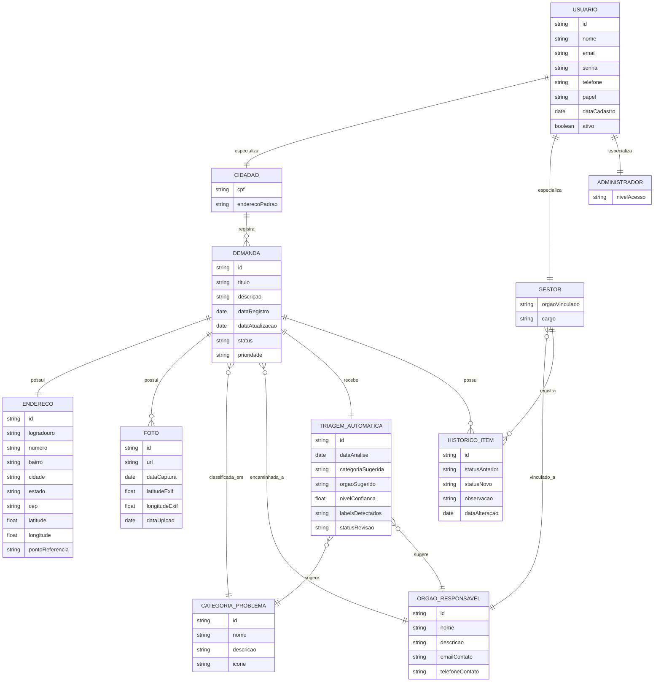

# Urbanize — Modelo Conceitual do Banco de Dados

## 1. Visão Geral

O Modelo Conceitual representa as entidades do domínio do Urbanize, seus atributos essenciais e os relacionamentos entre elas, de forma independente de tecnologia (sem tipos de dados específicos de SGBD, sem chaves técnicas como índices ou constraints físicas). O objetivo é capturar **o que** o sistema precisa representar, com base nas histórias de usuário e casos de uso do projeto.

---

## 2. Entidades e Atributos

### 2.1 Usuario
Entidade-base que representa qualquer pessoa com acesso ao sistema. É especializada em **Cidadão**, **Gestor** e **Administrador** (hierarquia de generalização/especialização).

| Atributo | Descrição |
|---|---|
| id | Identificador único do usuário |
| nome | Nome completo |
| email | E-mail de acesso (único) |
| senha | Credencial de acesso (armazenada de forma segura) |
| telefone | Contato do usuário |
| papel | Tipo de usuário: cidadão, gestor ou administrador |
| dataCadastro | Data de criação da conta |
| ativo | Indica se a conta está ativa |

**Histórias relacionadas**: 001 (Cadastrar conta), 002 (Fazer login)

---

### 2.2 Cidadao (especialização de Usuario)
Representa o munícipe que registra demandas.

| Atributo | Descrição |
|---|---|
| cpf | Documento de identificação (dado sensível — LGPD) |
| enderecoPadrao | Endereço de referência do cidadão (opcional, pode ser reaproveitado em novas demandas) |

**Histórias relacionadas**: 001, 003 (Registrar demanda), 010 (Dashboard do cidadão)

---

### 2.3 Gestor (especialização de Usuario)
Representa o profissional responsável por avaliar e encaminhar demandas.

| Atributo | Descrição |
|---|---|
| orgaoVinculado | Órgão público ao qual o gestor está vinculado |
| cargo | Cargo/função do gestor dentro do órgão |

**Histórias relacionadas**: 005 (Atualizar status), 007 (Painel do gestor), 008 (Revisar triagem), 009 (Aceitar encaminhamento)

---

### 2.4 Administrador (especialização de Usuario)
Representa o responsável pela configuração e manutenção geral do sistema (gestão de órgãos, categorias, usuários gestores).

| Atributo | Descrição |
|---|---|
| nivelAcesso | Nível de permissão administrativa |

---

### 2.5 Demanda
Entidade central do sistema — representa o problema urbano registrado pelo cidadão.

| Atributo | Descrição |
|---|---|
| id | Identificador único da demanda |
| titulo | Título/resumo do problema |
| descricao | Descrição detalhada fornecida pelo cidadão |
| dataRegistro | Data e hora do registro |
| dataAtualizacao | Data e hora da última atualização de status |
| status | Estado atual da demanda (registrada, em triagem, em análise, encaminhada, em andamento, resolvida, rejeitada) |
| prioridade | Prioridade atribuída (baixa, média, alta, urgente) |

**Histórias relacionadas**: 003 (Registrar demanda), 004 (Acompanhar status e histórico), 005 (Atualizar status), 006 (Listar e filtrar demandas)

---

### 2.6 Endereco
Localização geográfica associada a uma demanda.

| Atributo | Descrição |
|---|---|
| id | Identificador único |
| logradouro | Rua/avenida |
| numero | Número do imóvel/referência |
| bairro | Bairro |
| cidade | Cidade |
| estado | Estado (UF) |
| cep | Código postal |
| latitude | Coordenada geográfica (latitude) |
| longitude | Coordenada geográfica (longitude) |
| pontoReferencia | Ponto de referência adicional (opcional) |

**Histórias relacionadas**: 003 (Registrar demanda — endereço é parte do registro)

---

### 2.7 Foto
Evidência fotográfica enviada pelo cidadão, com metadados extraídos (EXIF) e usada como entrada para a triagem automática.

| Atributo | Descrição |
|---|---|
| id | Identificador único |
| url | Caminho/URL de armazenamento da imagem |
| dataCaptura | Data/hora em que a foto foi tirada (extraída do EXIF) |
| latitudeExif | Latitude extraída do EXIF (se disponível) |
| longitudeExif | Longitude extraída do EXIF (se disponível) |
| dataUpload | Data/hora do envio ao sistema |

**Histórias relacionadas**: 003 (Registrar demanda — foto é parte do registro), 008 (Revisar triagem automática — a foto é a entrada da IA)

---

### 2.8 CategoriaProblema
Classificação do tipo de problema urbano (saneamento, elétrico, pavimentação, iluminação pública, etc.).

| Atributo | Descrição |
|---|---|
| id | Identificador único |
| nome | Nome da categoria |
| descricao | Descrição da categoria |
| icone | Ícone/representação visual da categoria |

**Histórias relacionadas**: 003 (Registrar demanda), 006 (Listar e filtrar demandas), 008 (Revisar triagem)

---

### 2.9 OrgaoResponsavel
Entidade pública destinatária do encaminhamento da demanda.

| Atributo | Descrição |
|---|---|
| id | Identificador único |
| nome | Nome do órgão (ex.: Companhia de Saneamento, Companhia Elétrica) |
| descricao | Descrição/área de atuação |
| emailContato | Canal de contato do órgão |
| telefoneContato | Telefone do órgão |

**Histórias relacionadas**: 008 (Revisar triagem — sugestão de órgão), 009 (Aceitar encaminhamento)

---

### 2.10 TriagemAutomatica
Resultado da classificação feita pela IA (TensorFlow/MobileNet) a partir da foto enviada.

| Atributo | Descrição |
|---|---|
| id | Identificador único |
| dataAnalise | Data/hora em que a triagem foi executada |
| categoriaSugerida | Categoria de problema sugerida pela IA |
| orgaoSugerido | Órgão responsável sugerido pela IA |
| nivelConfianca | Score de confiança da classificação (ex.: 0.0 a 1.0) |
| labelsDetectados | Lista de rótulos/labels identificados na imagem (estrutura variável) |
| statusRevisao | Indica se a sugestão foi aceita, corrigida ou rejeitada pelo gestor |

**Histórias relacionadas**: 008 (Revisar triagem automática), 009 (Aceitar encaminhamento — `«extend»`)

---

### 2.11 HistoricoItem
Registro de cada mudança de status ocorrida na demanda — garante rastreabilidade/auditoria.

| Atributo | Descrição |
|---|---|
| id | Identificador único |
| statusAnterior | Status anterior da demanda |
| statusNovo | Novo status atribuído |
| observacao | Comentário/justificativa do gestor sobre a mudança |
| dataAlteracao | Data/hora da alteração |

**Histórias relacionadas**: 004 (Acompanhar status e histórico), 005 (Atualizar status e observação)

---

### 2.12 MetricasSistema
Entidade conceitual que agrega indicadores consolidados para os painéis (gestor e cidadão). Pode ser materializada como visão/consulta agregada, mas é representada conceitualmente pois alimenta diretamente os casos de uso de dashboard.

| Atributo | Descrição |
|---|---|
| totalDemandas | Total de demandas registradas |
| demandasPorStatus | Quantidade agrupada por status |
| demandasPorCategoria | Quantidade agrupada por categoria |
| tempoMedioResolucao | Tempo médio entre registro e resolução |
| demandasPorOrgao | Quantidade agrupada por órgão responsável |

**Histórias relacionadas**: 007 (Painel do gestor), 010 (Dashboard do cidadão)

---

## 3. Relacionamentos

| Relacionamento | Cardinalidade | Descrição |
|---|---|---|
| **Usuario → Cidadao / Gestor / Administrador** | Generalização/Especialização (1:1) | Um usuário assume exatamente um papel especializado |
| **Cidadao registra Demanda** | 1:N | Um cidadão pode registrar várias demandas; cada demanda pertence a um único cidadão |
| **Demanda possui Endereco** | 1:1 (ou N:1 se endereços forem reaproveitados) | Cada demanda está associada a um endereço/localização |
| **Demanda possui Foto(s)** | 1:N | Uma demanda pode ter uma ou mais fotos como evidência |
| **Demanda pertence a CategoriaProblema** | N:1 | Cada demanda é classificada em uma categoria; uma categoria agrupa várias demandas |
| **Demanda é encaminhada a OrgaoResponsavel** | N:1 | Cada demanda é encaminhada a um órgão; um órgão recebe várias demandas |
| **Demanda possui TriagemAutomatica** | 1:1 | Cada demanda recebe uma análise automática da IA (gerada a partir das fotos) |
| **TriagemAutomatica sugere CategoriaProblema / OrgaoResponsavel** | N:1 / N:1 | A IA sugere uma categoria e um órgão, que o gestor pode confirmar ou alterar |
| **Demanda possui HistoricoItem(s)** | 1:N | Cada mudança de status gera um novo item de histórico vinculado à demanda |
| **Gestor avalia/atualiza Demanda** | N:N (via HistoricoItem) | Um gestor pode atualizar várias demandas; uma demanda pode ser atualizada por diferentes gestores ao longo do tempo, registrado no histórico |
| **Gestor está vinculado a OrgaoResponsavel** | N:1 | Cada gestor pertence a um órgão; um órgão pode ter vários gestores |

---

## 4. Diagrama Entidade-Relacionamento (Conceitual)

> **Nota**: `MetricasSistema` não aparece no diagrama ER pois é uma entidade derivada/agregada (será implementada como consulta/visão sobre as demais entidades, e não como tabela primária).

---

## 5. Rastreabilidade: Entidades x Histórias de Usuário

| ID | História de Usuário | Entidades envolvidas |
|---|---|---|
| 001 | Cadastrar conta | Usuario, Cidadao |
| 002 | Fazer login | Usuario |
| 003 | Registrar demanda | Cidadao, Demanda, Endereco, Foto, CategoriaProblema |
| 004 | Acompanhar status e histórico | Demanda, HistoricoItem |
| 005 | Atualizar status (gestor) | Gestor, Demanda, HistoricoItem |
| 006 | Listar e filtrar demandas | Demanda, CategoriaProblema |
| 007 | Painel do gestor | Gestor, MetricasSistema |
| 008 | Revisar triagem automática | TriagemAutomatica, Foto, CategoriaProblema, OrgaoResponsavel |
| 009 | Aceitar encaminhamento | Gestor, TriagemAutomatica, OrgaoResponsavel, Demanda |
| 010 | Dashboard do cidadão | Cidadao, MetricasSistema |