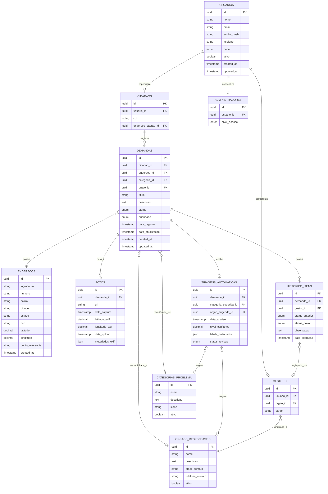

# Urbanize — Modelo Lógico do Banco de Dados

## 1. Visão Geral

O Modelo Lógico traduz o Modelo Conceitual em uma estrutura relacional normalizada (3FN), definindo tabelas, colunas, tipos de dados genéricos, chaves primárias (PK), chaves estrangeiras (FK), constraints e relacionamentos. Decisões de modelagem importantes:

- A generalização **Usuario → Cidadao / Gestor / Administrador** é resolvida pela estratégia **"Tabela por Subtipo com Tabela-Pai"** (Class Table Inheritance): a tabela `usuarios` concentra os dados comuns, e `cidadaos`, `gestores`, `administradores` guardam os atributos específicos, referenciando `usuarios` via FK/PK compartilhada.
- `TriagemAutomatica.labelsDetectados` (estrutura variável da IA) é modelado como campo de **dados semiestruturados (JSON)** — adequado ao PostgreSQL via `JSONB`, mas representado aqui de forma agnóstica como tipo `JSON`.
- `MetricasSistema` não é uma tabela primária — é resolvida via **views** (consultas agregadas), detalhadas na seção 8.
- Todas as tabelas possuem `created_at` / `updated_at` para auditoria (requisito LGPD).
- Identificadores (`id`) usam **UUID** como padrão lógico, garantindo unicidade em ambientes distribuídos e evitando exposição de sequência numérica de registros sensíveis.

---

## 2. Diagrama Entidade-Relacionamento (Lógico)



---

## 3. Especificação das Tabelas

### 3.1 `usuarios`

Tabela-pai da hierarquia de usuários. Concentra dados comuns a Cidadão, Gestor e Administrador.

| Coluna | Tipo | Constraints | Descrição |
|---|---|---|---|
| id | UUID | PK, DEFAULT gen_random_uuid() | Identificador único do usuário |
| nome | VARCHAR(150) | NOT NULL | Nome completo |
| email | VARCHAR(150) | NOT NULL, UNIQUE | E-mail de acesso |
| senha_hash | VARCHAR(255) | NOT NULL | Hash da senha (bcrypt) |
| telefone | VARCHAR(20) | NULL | Telefone de contato |
| papel | ENUM('cidadao','gestor','administrador') | NOT NULL | Define o tipo/papel do usuário |
| ativo | BOOLEAN | NOT NULL, DEFAULT true | Indica se a conta está ativa |
| created_at | TIMESTAMP | NOT NULL, DEFAULT now() | Data de criação do registro |
| updated_at | TIMESTAMP | NOT NULL, DEFAULT now() | Data da última atualização |

**Exemplo de valores**

| id | nome | email | papel | ativo |
|---|---|---|---|---|
| `a1b2...` | Maria Silva | maria.silva@email.com | cidadao | true |
| `c3d4...` | João Pereira | joao.pereira@compesa.gov.br | gestor | true |
| `e5f6...` | Admin Urbanize | admin@urbanize.gov.br | administrador | true |

---

### 3.2 `cidadaos`

Especialização de `usuarios` — atributos exclusivos do munícipe.

| Coluna | Tipo | Constraints | Descrição |
|---|---|---|---|
| id | UUID | PK, DEFAULT gen_random_uuid() | Identificador único do registro de cidadão |
| usuario_id | UUID | NOT NULL, UNIQUE, FK → usuarios.id (ON DELETE CASCADE) | Referência ao usuário base |
| cpf | VARCHAR(11) | NOT NULL, UNIQUE | CPF do cidadão (dado sensível — LGPD) |
| endereco_padrao_id | UUID | NULL, FK → enderecos.id (ON DELETE SET NULL) | Endereço de referência reutilizável em novas demandas |

---

### 3.3 `gestores`

Especialização de `usuarios` — atributos exclusivos do gestor público.

| Coluna | Tipo | Constraints | Descrição |
|---|---|---|---|
| id | UUID | PK, DEFAULT gen_random_uuid() | Identificador único do registro de gestor |
| usuario_id | UUID | NOT NULL, UNIQUE, FK → usuarios.id (ON DELETE CASCADE) | Referência ao usuário base |
| orgao_id | UUID | NOT NULL, FK → orgaos_responsaveis.id (ON DELETE RESTRICT) | Órgão ao qual o gestor está vinculado |
| cargo | VARCHAR(100) | NULL | Cargo/função do gestor |

---

### 3.4 `administradores`

Especialização de `usuarios` — atributos exclusivos do administrador do sistema.

| Coluna | Tipo | Constraints | Descrição |
|---|---|---|---|
| id | UUID | PK, DEFAULT gen_random_uuid() | Identificador único do registro de administrador |
| usuario_id | UUID | NOT NULL, UNIQUE, FK → usuarios.id (ON DELETE CASCADE) | Referência ao usuário base |
| nivel_acesso | ENUM('padrao','master') | NOT NULL, DEFAULT 'padrao' | Nível de permissão administrativa |

---

### 3.5 `enderecos`

Localização geográfica associada a uma demanda (ou ao endereço padrão de um cidadão).

| Coluna | Tipo | Constraints | Descrição |
|---|---|---|---|
| id | UUID | PK, DEFAULT gen_random_uuid() | Identificador único do endereço |
| logradouro | VARCHAR(200) | NOT NULL | Rua/avenida |
| numero | VARCHAR(10) | NULL | Número do imóvel/referência |
| bairro | VARCHAR(100) | NOT NULL | Bairro |
| cidade | VARCHAR(100) | NOT NULL, DEFAULT 'Recife' | Cidade |
| estado | CHAR(2) | NOT NULL, DEFAULT 'PE' | Estado (UF) |
| cep | VARCHAR(9) | NULL | CEP |
| latitude | DECIMAL(9,6) | NULL | Coordenada geográfica (latitude) |
| longitude | DECIMAL(9,6) | NULL | Coordenada geográfica (longitude) |
| ponto_referencia | VARCHAR(200) | NULL | Ponto de referência adicional |
| created_at | TIMESTAMP | NOT NULL, DEFAULT now() | Data de criação do registro |

**Exemplo de valores**

| id | logradouro | bairro | cidade | estado | latitude | longitude |
|---|---|---|---|---|---|---|
| `1a2b...` | Av. Boa Viagem | Boa Viagem | Recife | PE | -8.122000 | -34.897000 |
| `3c4d...` | Rua da Aurora | Boa Vista | Recife | PE | -8.061000 | -34.881000 |

---

### 3.6 `categorias_problema`

Tabela de domínio — tipos de problemas urbanos.

| Coluna | Tipo | Constraints | Descrição |
|---|---|---|---|
| id | UUID | PK, DEFAULT gen_random_uuid() | Identificador único da categoria |
| nome | VARCHAR(80) | NOT NULL, UNIQUE | Nome da categoria |
| descricao | TEXT | NULL | Descrição detalhada |
| icone | VARCHAR(50) | NULL | Identificador do ícone (para uso no frontend) |
| ativo | BOOLEAN | NOT NULL, DEFAULT true | Indica se a categoria está disponível para seleção |

**Exemplo de valores (dados de seed/população inicial)**

| id | nome | descricao | icone | ativo |
|---|---|---|---|---|
| `cat-001` | Saneamento | Problemas de esgoto, vazamentos e água | water-drop | true |
| `cat-002` | Elétrico | Postes, fios soltos, falta de energia | bolt | true |
| `cat-003` | Pavimentação | Buracos, calçadas danificadas | road | true |
| `cat-004` | Iluminação Pública | Lâmpadas queimadas, postes apagados | lightbulb | true |
| `cat-005` | Limpeza Urbana | Lixo acumulado, entulho | trash | true |

---

### 3.7 `orgaos_responsaveis`

Tabela de domínio — órgãos públicos destinatários das demandas.

| Coluna | Tipo | Constraints | Descrição |
|---|---|---|---|
| id | UUID | PK, DEFAULT gen_random_uuid() | Identificador único do órgão |
| nome | VARCHAR(150) | NOT NULL, UNIQUE | Nome do órgão |
| descricao | TEXT | NULL | Área de atuação |
| email_contato | VARCHAR(150) | NULL | E-mail de contato |
| telefone_contato | VARCHAR(20) | NULL | Telefone de contato |
| ativo | BOOLEAN | NOT NULL, DEFAULT true | Indica se o órgão está ativo para receber encaminhamentos |

**Exemplo de valores (dados de seed/população inicial)**

| id | nome | descricao |
|---|---|---|
| `org-001` | COMPESA | Companhia Pernambucana de Saneamento |
| `org-002` | CELPE/Neoenergia | Distribuidora de energia elétrica |
| `org-003` | EMLURB | Empresa de Manutenção e Limpeza Urbana do Recife |
| `org-004` | Secretaria de Infraestrutura | Pavimentação e obras viárias |

---

### 3.8 `demandas`

Tabela central do sistema — representa o problema urbano registrado.

| Coluna | Tipo | Constraints | Descrição |
|---|---|---|---|
| id | UUID | PK, DEFAULT gen_random_uuid() | Identificador único da demanda |
| cidadao_id | UUID | NOT NULL, FK → cidadaos.id (ON DELETE RESTRICT) | Cidadão que registrou a demanda |
| endereco_id | UUID | NOT NULL, FK → enderecos.id (ON DELETE RESTRICT) | Endereço/localização do problema |
| categoria_id | UUID | NOT NULL, FK → categorias_problema.id (ON DELETE RESTRICT) | Categoria final atribuída à demanda |
| orgao_id | UUID | NULL, FK → orgaos_responsaveis.id (ON DELETE SET NULL) | Órgão ao qual a demanda foi encaminhada |
| titulo | VARCHAR(150) | NOT NULL | Título/resumo do problema |
| descricao | TEXT | NOT NULL | Descrição detalhada |
| status | ENUM('registrada','em_triagem','em_analise','encaminhada','em_andamento','resolvida','rejeitada') | NOT NULL, DEFAULT 'registrada' | Estado atual da demanda |
| prioridade | ENUM('baixa','media','alta','urgente') | NOT NULL, DEFAULT 'media' | Prioridade da demanda |
| data_registro | TIMESTAMP | NOT NULL, DEFAULT now() | Data/hora do registro |
| data_atualizacao | TIMESTAMP | NOT NULL, DEFAULT now() | Data/hora da última atualização de status |
| created_at | TIMESTAMP | NOT NULL, DEFAULT now() | Data de criação do registro |
| updated_at | TIMESTAMP | NOT NULL, DEFAULT now() | Data da última atualização do registro |

> **Nota**: `categoria_id` é `NOT NULL` pois toda demanda precisa de uma classificação (inicialmente vinda da triagem da IA, podendo ser corrigida pelo gestor). `orgao_id` é `NULL` até que o gestor confirme o encaminhamento.

---

### 3.9 `fotos`

Evidências fotográficas vinculadas a uma demanda.

| Coluna | Tipo | Constraints | Descrição |
|---|---|---|---|
| id | UUID | PK, DEFAULT gen_random_uuid() | Identificador único da foto |
| demanda_id | UUID | NOT NULL, FK → demandas.id (ON DELETE CASCADE) | Demanda à qual a foto pertence |
| url | VARCHAR(255) | NOT NULL | Caminho/URL de armazenamento da imagem |
| data_captura | TIMESTAMP | NULL | Data/hora de captura (extraída do EXIF) |
| latitude_exif | DECIMAL(9,6) | NULL | Latitude extraída do EXIF |
| longitude_exif | DECIMAL(9,6) | NULL | Longitude extraída do EXIF |
| data_upload | TIMESTAMP | NOT NULL, DEFAULT now() | Data/hora do envio ao sistema |
| metadados_exif | JSON | NULL | Demais metadados EXIF extraídos (câmera, resolução, etc.) |

---

### 3.10 `triagens_automaticas`

Resultado da classificação automática (TensorFlow/MobileNet) sobre as fotos da demanda.

| Coluna | Tipo | Constraints | Descrição |
|---|---|---|---|
| id | UUID | PK, DEFAULT gen_random_uuid() | Identificador único da triagem |
| demanda_id | UUID | NOT NULL, UNIQUE, FK → demandas.id (ON DELETE CASCADE) | Demanda analisada |
| categoria_sugerida_id | UUID | NULL, FK → categorias_problema.id (ON DELETE SET NULL) | Categoria sugerida pela IA |
| orgao_sugerido_id | UUID | NULL, FK → orgaos_responsaveis.id (ON DELETE SET NULL) | Órgão sugerido pela IA |
| data_analise | TIMESTAMP | NOT NULL, DEFAULT now() | Data/hora da execução da triagem |
| nivel_confianca | DECIMAL(5,4) | NOT NULL, CHECK (nivel_confianca BETWEEN 0 AND 1) | Score de confiança da classificação (0.0000 a 1.0000) |
| labels_detectados | JSON | NULL | Lista de labels/scores brutos retornados pelo MobileNet |
| status_revisao | ENUM('pendente','aceita','corrigida','rejeitada') | NOT NULL, DEFAULT 'pendente' | Resultado da revisão do gestor sobre a sugestão da IA |

**Exemplo de valor (campo `labels_detectados`)**

```json
{
  "predictions": [
    { "label": "manhole", "score": 0.81 },
    { "label": "puddle", "score": 0.62 },
    { "label": "street", "score": 0.55 }
  ],
  "modelo": "mobilenet_v2",
  "versao": "2.1.1"
}
```

---

### 3.11 `historico_itens`

Linha do tempo de mudanças de status de uma demanda — auditoria.

| Coluna | Tipo | Constraints | Descrição |
|---|---|---|---|
| id | UUID | PK, DEFAULT gen_random_uuid() | Identificador único do item de histórico |
| demanda_id | UUID | NOT NULL, FK → demandas.id (ON DELETE CASCADE) | Demanda à qual o histórico pertence |
| gestor_id | UUID | NULL, FK → gestores.id (ON DELETE SET NULL) | Gestor responsável pela alteração (NULL se automática/sistema) |
| status_anterior | ENUM('registrada','em_triagem','em_analise','encaminhada','em_andamento','resolvida','rejeitada') | NULL | Status antes da alteração (NULL no primeiro registro) |
| status_novo | ENUM('registrada','em_triagem','em_analise','encaminhada','em_andamento','resolvida','rejeitada') | NOT NULL | Novo status atribuído |
| observacao | TEXT | NULL | Comentário/justificativa da alteração |
| data_alteracao | TIMESTAMP | NOT NULL, DEFAULT now() | Data/hora da alteração |

---

## 4. Resumo de Chaves Primárias e Estrangeiras

| Tabela | PK | FKs |
|---|---|---|
| usuarios | id | — |
| cidadaos | id | usuario_id → usuarios.id; endereco_padrao_id → enderecos.id |
| gestores | id | usuario_id → usuarios.id; orgao_id → orgaos_responsaveis.id |
| administradores | id | usuario_id → usuarios.id |
| enderecos | id | — |
| categorias_problema | id | — |
| orgaos_responsaveis | id | — |
| demandas | id | cidadao_id → cidadaos.id; endereco_id → enderecos.id; categoria_id → categorias_problema.id; orgao_id → orgaos_responsaveis.id |
| fotos | id | demanda_id → demandas.id |
| triagens_automaticas | id | demanda_id → demandas.id; categoria_sugerida_id → categorias_problema.id; orgao_sugerido_id → orgaos_responsaveis.id |
| historico_itens | id | demanda_id → demandas.id; gestor_id → gestores.id |

---

## 5. Constraints Adicionais (Regras de Negócio)

- `usuarios.email` deve ser único e validado em formato (validação aplicada na camada de aplicação).
- `cidadaos.cpf` deve ser único e ter exatamente 11 caracteres numéricos.
- `triagens_automaticas.nivel_confianca` deve estar entre 0 e 1 (`CHECK`).
- `demandas.status` e `historico_itens.status_novo` compartilham o mesmo domínio de valores (ENUM `status_demanda`), garantindo consistência entre o estado atual e o histórico.
- `triagens_automaticas.demanda_id` é `UNIQUE` — cada demanda recebe **uma única** triagem automática (reprocessamentos atualizam o registro existente, não criam novos).
- `fotos.demanda_id` permite múltiplas fotos por demanda (1:N), mas toda foto deve pertencer a exatamente uma demanda (`NOT NULL`).

---

## 6. Triggers

### 6.1 `trg_update_demanda_data_atualizacao`
**Evento**: `BEFORE UPDATE` em `demandas`
**Função**: sempre que qualquer coluna de `demandas` for atualizada, atualiza automaticamente `data_atualizacao` e `updated_at` para o timestamp atual — garante que o cidadão sempre veja a data correta da última mudança no acompanhamento (História 004).

```sql
CREATE OR REPLACE FUNCTION fn_update_demanda_timestamps()
RETURNS TRIGGER AS $$
BEGIN
    NEW.data_atualizacao := now();
    NEW.updated_at := now();
    RETURN NEW;
END;
$$ LANGUAGE plpgsql;

CREATE TRIGGER trg_update_demanda_data_atualizacao
BEFORE UPDATE ON demandas
FOR EACH ROW
EXECUTE FUNCTION fn_update_demanda_timestamps();
```

---

### 6.2 `trg_log_status_change`
**Evento**: `AFTER UPDATE` em `demandas`, quando `status` é alterado
**Função**: insere automaticamente um novo registro em `historico_itens` sempre que o status de uma demanda muda — garante que **toda** transição de status seja auditada, mesmo que a aplicação esqueça de criar o item de histórico manualmente (reforço de integridade para LGPD/auditoria).

```sql
CREATE OR REPLACE FUNCTION fn_log_status_change()
RETURNS TRIGGER AS $$
BEGIN
    IF OLD.status IS DISTINCT FROM NEW.status THEN
        INSERT INTO historico_itens (
            demanda_id, status_anterior, status_novo, observacao, data_alteracao
        ) VALUES (
            NEW.id, OLD.status, NEW.status, 'Alteração automática de status', now()
        );
    END IF;
    RETURN NEW;
END;
$$ LANGUAGE plpgsql;

CREATE TRIGGER trg_log_status_change
AFTER UPDATE ON demandas
FOR EACH ROW
EXECUTE FUNCTION fn_log_status_change();
```

> **Observação**: na prática, a aplicação inserirá o `historico_itens` com `observacao` e `gestor_id` preenchidos (História 005). Este trigger atua como **rede de segurança** — caso a aplicação falhe em registrar o histórico, a auditoria não fica incompleta.

---

### 6.3 `trg_validate_triagem_confianca`
**Evento**: `BEFORE INSERT OR UPDATE` em `triagens_automaticas`
**Função**: garante que, caso `nivel_confianca` seja menor que um limiar mínimo (ex.: 0.4), o `status_revisao` seja forçado para `'pendente'`, sinalizando ao gestor que a sugestão da IA é pouco confiável e precisa de atenção redobrada (Histórias 008/009 — "a IA não é 100% confiável").

```sql
CREATE OR REPLACE FUNCTION fn_validate_triagem_confianca()
RETURNS TRIGGER AS $$
BEGIN
    IF NEW.nivel_confianca < 0.4 THEN
        NEW.status_revisao := 'pendente';
    END IF;
    RETURN NEW;
END;
$$ LANGUAGE plpgsql;

CREATE TRIGGER trg_validate_triagem_confianca
BEFORE INSERT OR UPDATE ON triagens_automaticas
FOR EACH ROW
EXECUTE FUNCTION fn_validate_triagem_confianca();
```

---

## 7. Índices Recomendados

| Índice | Tabela | Coluna(s) | Justificativa |
|---|---|---|---|
| idx_demandas_status | demandas | status | Filtros frequentes por status (Histórias 004, 006, 007) |
| idx_demandas_categoria | demandas | categoria_id | Filtros e agregações por categoria (Histórias 006, 007) |
| idx_demandas_cidadao | demandas | cidadao_id | Listagem das demandas de um cidadão (História 010) |
| idx_demandas_orgao | demandas | orgao_id | Filtros por órgão no painel do gestor (História 007) |
| idx_demandas_data_registro | demandas | data_registro | Ordenação e filtros por período |
| idx_enderecos_geo | enderecos | latitude, longitude | Consultas geoespaciais (proximidade, agrupamento por região) |
| idx_historico_demanda | historico_itens | demanda_id | Recuperação do histórico completo de uma demanda (História 004) |
| idx_triagens_status_revisao | triagens_automaticas | status_revisao | Listagem de triagens pendentes de revisão (História 008) |

---

## 8. Views (suporte a `MetricasSistema`)

### 8.1 `vw_metricas_gestor`
Agrega indicadores para o painel do gestor (História 007).

```sql
CREATE VIEW vw_metricas_gestor AS
SELECT
    o.id AS orgao_id,
    o.nome AS orgao_nome,
    d.status,
    c.nome AS categoria_nome,
    COUNT(d.id) AS total_demandas,
    AVG(EXTRACT(EPOCH FROM (d.data_atualizacao - d.data_registro)) / 86400)
        AS tempo_medio_resolucao_dias
FROM demandas d
JOIN categorias_problema c ON c.id = d.categoria_id
LEFT JOIN orgaos_responsaveis o ON o.id = d.orgao_id
GROUP BY o.id, o.nome, d.status, c.nome;
```

### 8.2 `vw_metricas_cidadao`
Agrega indicadores para o dashboard do cidadão (História 010).

```sql
CREATE VIEW vw_metricas_cidadao AS
SELECT
    c.id AS cidadao_id,
    COUNT(d.id) AS total_demandas,
    COUNT(d.id) FILTER (WHERE d.status = 'resolvida') AS demandas_resolvidas,
    COUNT(d.id) FILTER (WHERE d.status NOT IN ('resolvida','rejeitada')) AS demandas_em_andamento
FROM cidadaos c
LEFT JOIN demandas d ON d.cidadao_id = c.id
GROUP BY c.id;
```
