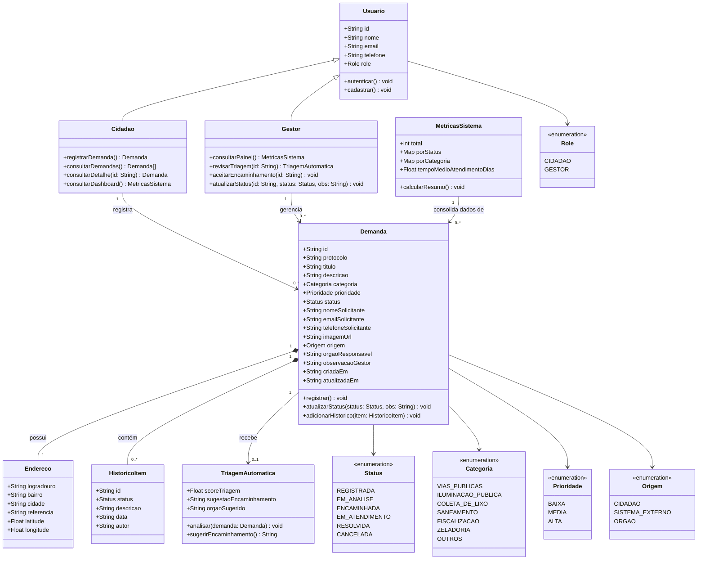

```mermaid
graph TB
    CIDADAO(["🧑 Cidadão"])
    GESTOR(["🧑 Gestor"])

    subgraph SYS["Sistema Urbanize"]

        subgraph AUTH["Autenticação"]
            UC_LOGIN(["Fazer login"])
            UC_CADASTRO(["Cadastrar-se"])
        end

        subgraph CID["Funcionalidades do Cidadão"]
            UC_NOVA(["Registrar nova demanda"])
            UC_LISTAR(["Listar e filtrar demandas"])
            UC_DETALHE(["Visualizar detalhe da demanda"])
            UC_HISTORICO(["Acompanhar status e histórico"])
            UC_DASHBOARD(["Consultar dashboard do cidadão"])
        end

        subgraph GEST["Funcionalidades do Gestor"]
            UC_PAINEL(["Consultar painel do gestor"])
            UC_METRICAS(["Visualizar métricas"])
            UC_FILA(["Filtrar fila de demandas"])
            UC_TRIAGEM(["Revisar triagem automática"])
            UC_ENCAMINHAR(["Aceitar sugestão de encaminhamento"])
            UC_ATUALIZAR(["Atualizar status e observação"])
        end

    end

    %% Associações do Cidadão
    CIDADAO --> UC_CADASTRO
    CIDADAO --> UC_NOVA
    CIDADAO --> UC_LISTAR
    CIDADAO --> UC_DETALHE
    CIDADAO --> UC_DASHBOARD

    %% Associações do Gestor
    GESTOR --> UC_LOGIN
    GESTOR --> UC_PAINEL
    GESTOR --> UC_TRIAGEM
    GESTOR --> UC_ATUALIZAR

    %% include: Cadastrar-se inclui Fazer login
    UC_CADASTRO -. "«include»" .-> UC_LOGIN

    %% include: Funcionalidades protegidas incluem Fazer login
    UC_NOVA -. "«include»" .-> UC_LOGIN
    UC_LISTAR -. "«include»" .-> UC_LOGIN
    UC_DETALHE -. "«include»" .-> UC_LOGIN
    UC_DASHBOARD -. "«include»" .-> UC_LOGIN

    %% include: Detalhe inclui Histórico
    UC_DETALHE -. "«include»" .-> UC_HISTORICO

    %% include: Painel do gestor inclui subcasos de interface interna
    UC_PAINEL -. "«include»" .-> UC_METRICAS
    UC_PAINEL -. "«include»" .-> UC_FILA

    %% extend: Aceitar encaminhamento estende Revisar triagem
    UC_ENCAMINHAR -. "«extend»" .-> UC_TRIAGEM
```

# MODELAGEM CONCEITUAL

**Projeto:** Urbanize — Plataforma de Gestão de Demandas Urbanas  
**Equipe:** Diego David, Hyngrid Souza e Pamela Rodrigues  
**Data:** Maio de 2026

---

## Introdução

A modelagem conceitual organiza e representa graficamente o entendimento construído sobre o problema. Com base na análise de domínio e nas histórias de usuário, este documento apresenta o **Diagrama de Casos de Uso** e o **Diagrama de Classes** do sistema Urbanize, traduzindo as necessidades levantadas em representações formais que servem de base para comunicação entre a equipe e para o planejamento das próximas fases.

---

## Diagrama de Casos de Uso

### Diagrama

### Notas e Decisões

| Decisão | Justificativa |
| --- | --- |
| **"Fazer login" modelado como `«include»`** | Login é um mecanismo de autenticação transversal, não um objetivo final de negócio. Todas as funcionalidades protegidas o incluem implicitamente, tornando o relacionamento de inclusão mais preciso do que um caso de uso independente duplicado para cada ator. |
| **"Visualizar métricas" e "Filtrar fila" como `«include»` de "Consultar painel do gestor"** | Essas ações são comportamentos internos da mesma tela do painel. Modelá-las como casos de uso independentes seria granularidade excessiva. Elas foram agrupadas sob "Consultar painel do gestor" com relacionamento de inclusão, refletindo que ocorrem no mesmo contexto. |
| **"Aceitar sugestão de encaminhamento" como `«extend»` de "Revisar triagem automática"** | O aceite da sugestão é uma ação opcional e condicional: ocorre apenas quando o gestor decide aceitar a proposta ao revisar a triagem. O relacionamento de extensão representa corretamente esse comportamento facultativo. |
| **Triagem automática representada como serviço interno ao sistema** | A triagem é executada pelo próprio Urbanize: a imagem pode ser classificada no frontend com TensorFlow.js/MobileNet e validada no backend com Google Vision quando configurado. Representá-la como ator externo seria impreciso. |
| **Órgão responsável removido como ator externo** | A integração real com órgãos públicos está fora do escopo desta versão. O encaminhamento existe como sugestão gerada pelo sistema, sem comunicação efetiva com sistemas externos no MVP. |

---

## Diagrama de Classes

### Diagrama

### Notas e Decisões

| Decisão | Justificativa |
| --- | --- |
| **Herança de `Cidadao` e `Gestor` a partir de `Usuario`** | Ambos os perfis compartilham atributos comuns (id, nome, email, role). A herança evita duplicação e reflete a distinção de responsabilidades de cada perfil por meio de métodos específicos em cada subclasse. |
| **Composição entre `Demanda`, `Endereco` e `HistoricoItem`** | `Endereco` e `HistoricoItem` não existem sem a `Demanda`. A composição representa corretamente esse ciclo de vida compartilhado: ao remover uma demanda, seus dados de endereço e histórico perdem sentido isoladamente. |
| **Associação entre `Demanda` e `TriagemAutomatica`** | A triagem é um processo opcional (nem toda demanda tem triagem concluída). A multiplicidade `0..1` reflete que a triagem pode ou não ter sido executada no momento da consulta. |
| **`MetricasSistema` como classe independente** | As métricas consolidam dados de múltiplas demandas para uso no painel do gestor e no dashboard do cidadão. Mantê-la separada respeita o princípio de responsabilidade única e facilita extensões futuras. |
| **Enumerações para Status, Categoria, Prioridade, Role e Origem** | Os valores são fixos, controlados pelo sistema e mapeados diretamente do código-fonte (`frontend/src/types/demand.ts`, `frontend/src/types/user.ts`). Enumerações garantem consistência e evitam valores inválidos. |

---

## Coerência com as Histórias de Usuário

| ID | História de Usuário | Elemento do Diagrama de Classes | Casos de Uso relacionados |
| --- | --- | --- | --- |
| 001 | Cadastrar conta | `Usuario.cadastrar()`, `Cidadao` | Cadastrar-se |
| 002 | Fazer login | `Usuario.autenticar()` | Fazer login (`«include»`) |
| 003 | Registrar demanda | `Demanda.registrar()`, `Cidadao.registrarDemanda()` | Registrar nova demanda |
| 004 | Acompanhar status e histórico | `HistoricoItem`, `Demanda.status` | Visualizar detalhe, Acompanhar histórico |
| 005 | Atualizar status (gestor) | `Gestor.atualizarStatus()`, `Demanda.atualizarStatus()` | Atualizar status e observação |
| 006 | Listar e filtrar demandas | `Demanda[]`, `FilterState` | Listar e filtrar demandas |
| 007 | Painel do gestor | `Gestor.consultarPainel()`, `MetricasSistema` | Consultar painel do gestor |
| 008 | Revisar triagem automática | `TriagemAutomatica.analisar()` | Revisar triagem automática |
| 009 | Aceitar encaminhamento | `Gestor.aceitarEncaminhamento()`, `TriagemAutomatica.sugestaoEncaminhamento` | Aceitar sugestão (`«extend»`) |
| 010 | Dashboard do cidadão | `Cidadao.consultarDashboard()`, `MetricasSistema` | Consultar dashboard do cidadão |
