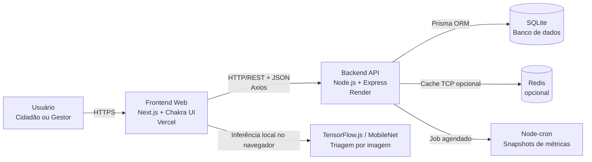

# Requisitos da disciplina — Projetos / Embarque Digital

**Nome do grupo:** Urbanize

Este documento indica onde cada requisito avaliado está implementado no projeto.

## 1. Arquitetura distribuída

O Urbanize utiliza uma arquitetura distribuída do tipo **cliente-servidor**, separando a aplicação em dois componentes principais:

- **Frontend Web:** aplicação Next.js hospedada na Vercel, responsável pela interface do cidadão e do gestor.
- **Backend API:** serviço Node.js/Express hospedado no Render, responsável pelas regras de negócio, autenticação, persistência, upload de imagens, métricas e permissões.
- **Banco de dados:** SQLite acessado pelo backend via Prisma ORM.
- **Cache opcional:** Redis, usado quando `REDIS_URL` está configurado, para cache de métricas.

A escolha por cliente-servidor foi feita porque o sistema precisa separar a experiência do usuário da camada de regras de negócio e dados. Isso facilita manutenção, deploy independente do frontend/backend e integração via API REST.

## 2. Desenho da arquitetura

**Comunicação entre componentes:**

| Origem | Destino | Protocolo/Formato | Uso |
|---|---|---|---|
| Navegador do usuário | Frontend Vercel | HTTPS | Acesso à interface web |
| Frontend | Backend Render | HTTP/REST com JSON | Login, cadastro, demandas, métricas e uploads |
| Backend | Banco SQLite | Prisma ORM / acesso local ao arquivo do banco | Persistência de usuários, demandas, órgãos e métricas |
| Backend | Redis opcional | TCP via `ioredis` | Cache de métricas quando configurado |
| Backend | Cron interno | Agendamento em processo via `node-cron` | Consolidação periódica de snapshots de métricas |

## 3. Concorrência e paralelismo

O projeto aplica concorrência principalmente no backend Node.js, usando operações assíncronas com `async/await`, Promises e o event loop do Node.

Pontos principais:

- **Atendimento concorrente de requisições HTTP:** implementado pelo Express em `backend/src/app.ts` e inicializado em `backend/src/server.ts`. O servidor consegue lidar com múltiplas requisições simultâneas sem bloquear a aplicação inteira.
- **Consultas concorrentes de métricas:** em `backend/src/services/metricsService.ts`, a função `calculateMetricsSummary` usa `Promise.all` para executar contagens e consultas ao banco em paralelo lógico, reduzindo o tempo de resposta do endpoint de métricas.
- **Processamento em segundo plano:** em `backend/src/config/cron.ts`, o `node-cron` executa periodicamente `metricsService.persistSnapshot()` sem depender de uma ação direta do usuário.
- **Triagem por imagem no cliente:** o frontend executa a classificação com TensorFlow.js/MobileNet no navegador, evitando bloquear o backend com inferência de imagem em cenários comuns.

Essa abordagem melhora a responsividade do sistema, evita bloqueios desnecessários e permite que tarefas de métricas e requisições de usuários ocorram de forma independente.

## 4. Otimização

O projeto contempla otimizações já implementadas e pontos planejados para evolução.

**Otimizações implementadas:**

- **Cache opcional de métricas com Redis:** `backend/src/config/redis.ts` e `backend/src/services/metricsService.ts` permitem armazenar o resumo de métricas por curto período, reduzindo consultas repetidas ao banco.
- **Consultas paralelas com `Promise.all`:** o cálculo de métricas executa múltiplas consultas de forma concorrente, diminuindo o tempo total de resposta.
- **Snapshots periódicos com cron:** `backend/src/config/cron.ts` consolida métricas periodicamente, permitindo histórico e evitando recalcular tudo manualmente em todos os cenários.
- **Triagem local por imagem:** o uso de TensorFlow.js/MobileNet no frontend reduz carga no backend e melhora a experiência do usuário, pois a análise inicial acontece no próprio navegador.
- **Separação frontend/backend:** permite escalar, atualizar e fazer deploy de cada camada separadamente.

**Otimizações futuras possíveis:**

- Migrar o banco de SQLite para PostgreSQL em produção, melhorando concorrência, persistência e escalabilidade.
- Usar armazenamento externo para imagens, como Cloudinary, S3 ou Supabase Storage, em vez de armazenamento local.
- Adicionar paginação e índices específicos para consultas de demandas em bases maiores.
- Ativar Redis em produção para cache efetivo das métricas.
- Adicionar fila assíncrona para processamentos pesados, como análise avançada de imagens ou notificações.
